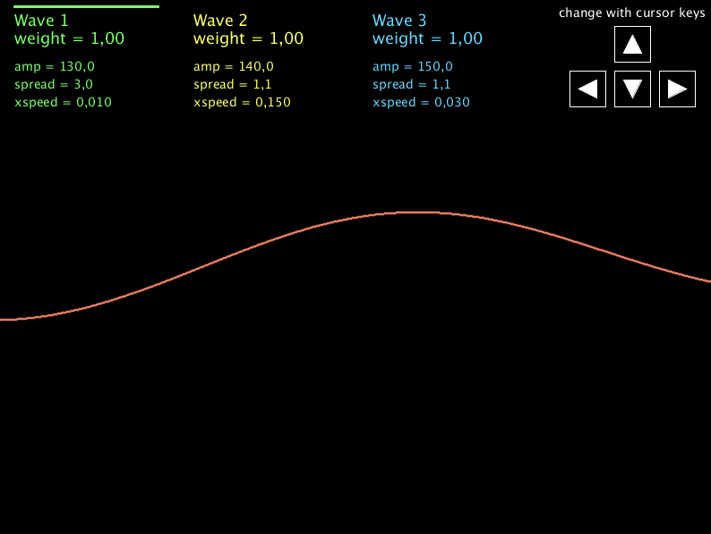
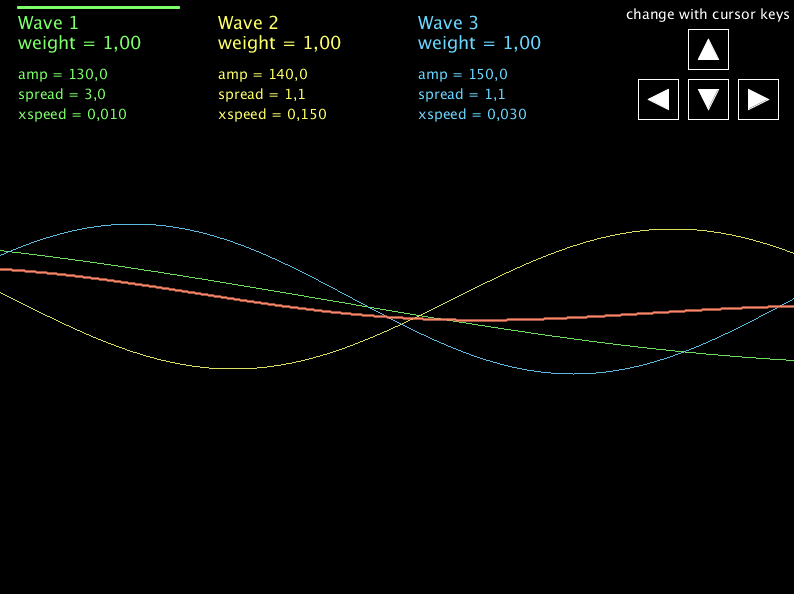

# Wavemaker

_This is a tool for the [Processing](http://processing.org) language/environment.
After starting Processing, open the Wavemaker.pde file._

The tool combines three sine waves into a single wave. This is done
through a linear combination, i.e. each wave
is integrated based on an individual _weight_ (between 0 and 1). A technial detail:
When computing the combined wave the three weights are normalized such that
they add up to 1.

You can modify the three underlying waves using the cursor keys:

- weight: how strongly this wave influences the combined wave (between 0 and 1)
- amplitude: how high/low the curve's peaks are
- spread: how wide (spread out) a sine curve (= one hill, one valley) is, 1 means
that there is a single sine curve on screen, 2 means it is twice as wide etc.
- xspeed: the speed with which the curve travels from right to left (unit is radians)

You switch on/off the three underlying waves with the keys 1, 2 and 3.

